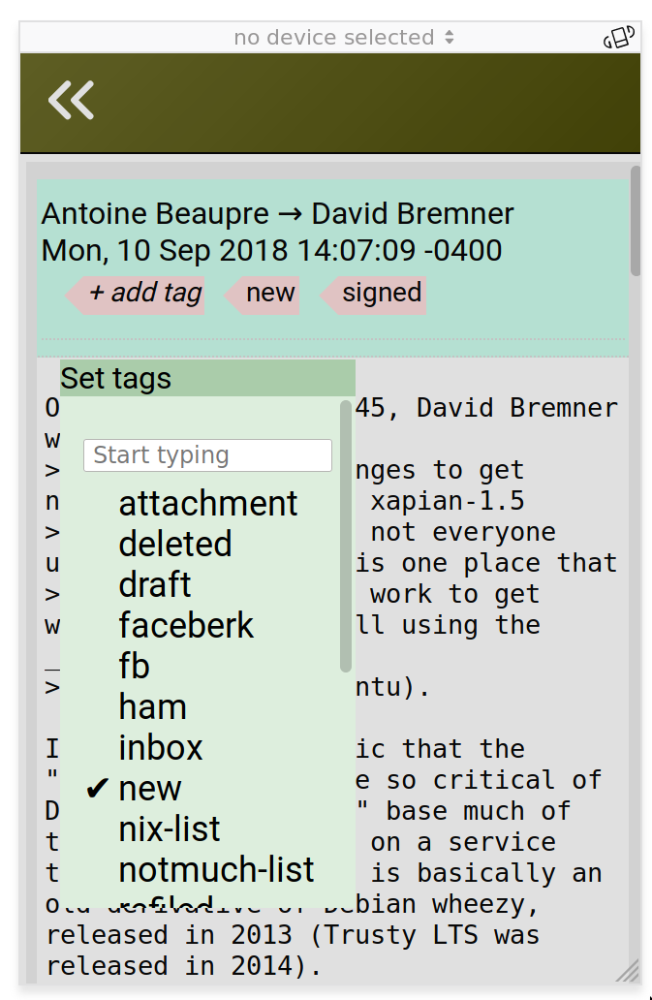

# Epsilon

" an arbitrarily small positive quantity"

Aspires to be a mobile-friendly web interface for
the [notmuch mail client](https://notmuchmail.org/).  As of September
2018 it mostly works for my needs except that it does not provide any
message composition/sending interface, but *has not been tested on
anybody else and has not been audited for security*.

Don't say I didn't warn you.  What, you're still reading?

## UI

The default view is a "search" page that allows search by tags or any
other syntax that Notmuch understands


Clicking on a search result shows the messages in the thread.  Some
attempt is made to display HTML messages (the ability to turn this off
is forthcoming, I promise)


Clicing on a tag in the thread page pops up a tag editor which allows
you to add/delete tags on the current message




## Building/Installing

### Quick deployment/dogfood instructions

This works for [Nix](https://nixos.org/nix/) users.  If that's not
you, better instructions will be forthcoming eventually.  Sorry.


```
$ nix-env -f 'https://github.com/telent/epsilon/archive/master.tar.gz' -i
$ epsilon :port 8111
$ $preferred_web_browser http://localhost:8111
```

It's unlikely you really want to run it on the local machine, but
obviously you should not run it on any other machine without
considering the securoty implications.  Here are some factoids you may
consider

* Android ConnectBot has port forwarding, or
* you can put an SSL proxy in front of it using stunnel or hitch or
  similar
* if there are or might be other users on your host machine, they will
  be able to read your mail if they connect to the port you started
  epsilon on.  A rudimentary safeguard is to run 

```
notnuch config set epsilon.password my-secret-code
```
then it will prompt you for that code when you visit it.  It passes
whatever you type in plaintext, so see above note about HTTPS.

  


### Development environment

You will need to have installed:

* nodejs (icons are installed from an npm package)
* clojure 1.9 with the cli tools (`clojure` should be on your path)
* [boot-clj](http://boot-clj.com/)

(On Nix you can do this using `nix-shell`)

First, install and convert the icons - this will create about 260 cljs
files in `generated/epsilon/icons/`

```
$ npm install
$ clojure  -A:build -m hiccupize-icons node_modules/feather-icons/dist/icons/
```

(On Nix you can do this by running `eval "$makeIcons"` in the nix-shell environemnt)


Next, you will want a couple of windows or tabs or similar.  In the first one run

```
tab1$ boot watch cljs target
```

and in the second

```
tab2$ boot use-target cider repl

epsilon.server=> (run {})
```


## Dependencies

Whenever you change `deps.edn`, and assuming you care about building
the production build with Nix, you will also need to update
`deps.json`.  Do this by running something like

```
$ CLJ_CONFIG=. CLJ_CACHE=. clojure -A:build -A:nixtract -Srepro  -Sforce  -m nixtract deps.json
```
